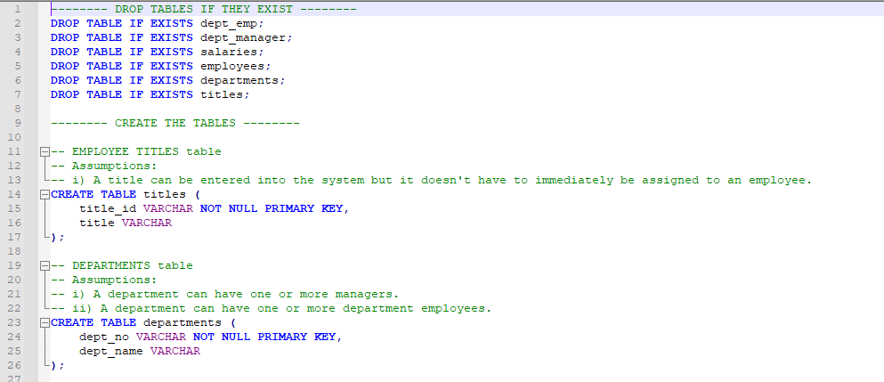

# Pewlett Hackard Employee Postgres Database

## Overview of the Project
Creates a PostgreSQL database for the hypothetical company Pewlett Hackard and runs queries on employee demographics.

#### Table schemata

#### Queries

 

## Tools/Packages used
- SQL
- PostgreSQL
- pgAdmin

 

## How to run
- Download the respository
- Open pgAdmin (for PostgreSQL) and create database named **Employees**
- Open the EmployeeSQL folder in the repository and run the [Schemata file](EmployeeSQL/Schemata.sql) in the database to create the database tables.
- Populate the database tables in the following order using data from the [data](EmployeeSQL/extra material/data) folder:
  - titles
  - departments
  - employees
  - salaries
  - dept_manager
  - dept_emp
- Open the EmployeeSQL folder in the repository and run the [Data Analysis Queries SQL file](EmployeeSQL/Data-Analysis-Queries.sql) in the database to create the database schemata.
